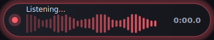
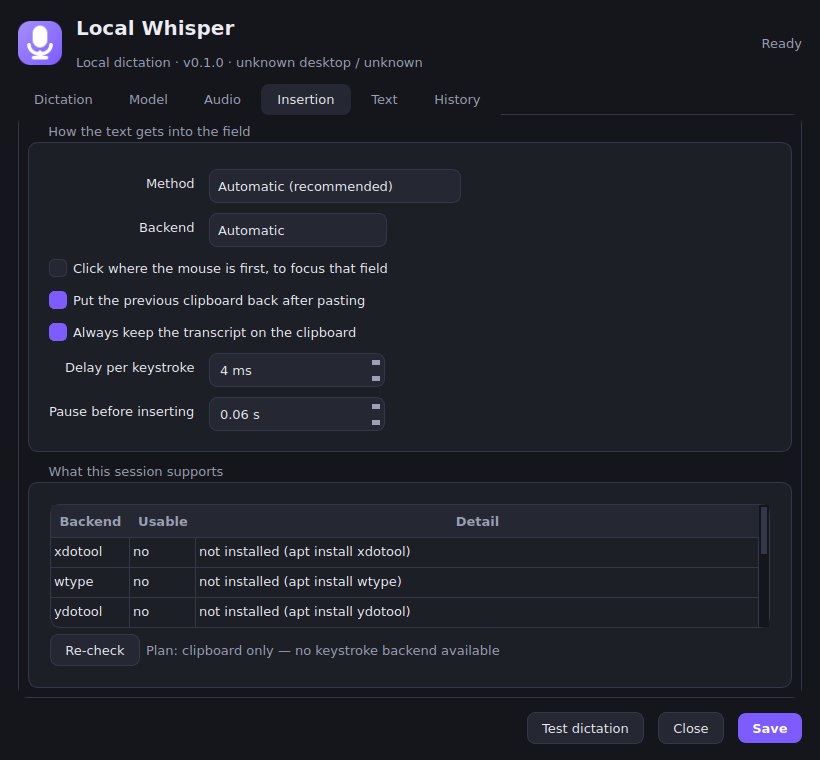
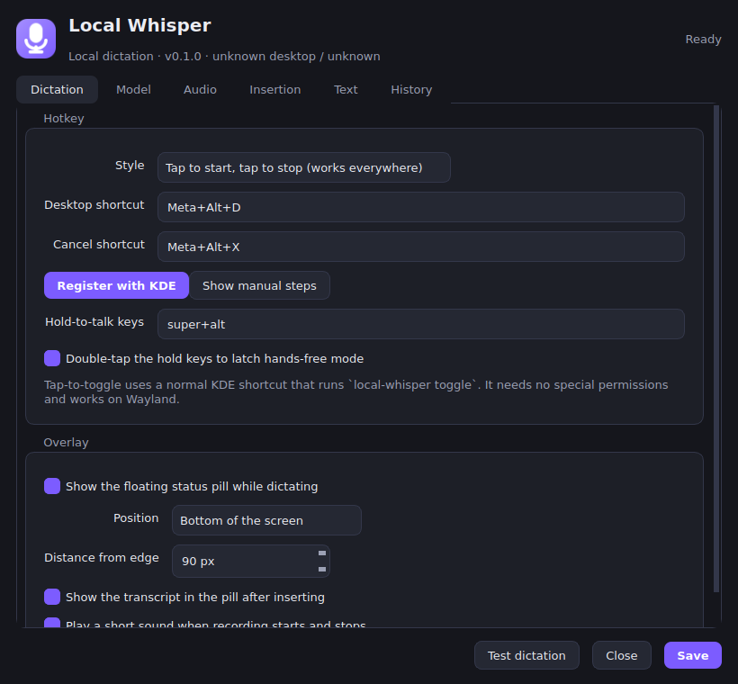
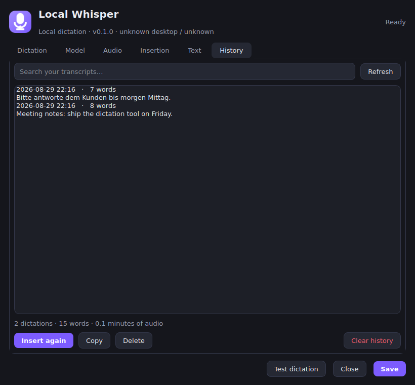

# Local Whisper

Hold a key, talk, let go — the text appears in whatever field you were already
typing in. Like [Wispr Flow](https://wisprflow.ai/), except the audio never
leaves your machine and the whole thing is a few thousand lines of Python you
can read.

Built for Debian + KDE Plasma, and it works on both Wayland and X11.




---

## What it does

1. You press the hotkey (`Meta+Alt+D` by default, or hold `Super+Alt`).
2. A pill fades in at the bottom of the screen showing the live microphone level.
3. You speak. Releasing the key — or two seconds of silence in hands-free mode
   — ends the take.
4. Whisper transcribes it locally, filler sounds are stripped, and the text is
   inserted into the focused field.

That is the same loop Wispr Flow runs: press, speak, release, text appears
where the caret is, in two to four seconds. What is different here is that
transcription happens on your own CPU or GPU with
[faster-whisper](https://github.com/SYSTRAN/faster-whisper), there is no
account, and nothing is uploaded.

## Install

```bash
git clone https://github.com/over-code/local-whisper.git
cd local-whisper
./install.sh
```

The installer creates a virtualenv under `~/.local/share/local-whisper`, links
`local-whisper` into `~/.local/bin`, installs the desktop entry, and then asks
before each optional step (autostart service, KDE shortcuts, input-group
permissions). `./install.sh --minimal` skips all of them,
`./install.sh --uninstall` reverses it.

Then:

```bash
local-whisper doctor      # what works on this machine, and how to fix what does not
local-whisper daemon      # start the tray app (the service does this for you)
```

The first dictation downloads the model (~480 MB for `small`). After that the
machine can be offline forever.

### Manual install

```bash
sudo apt install python3-venv libportaudio2 wl-clipboard wtype ydotool   # Wayland
sudo apt install python3-venv libportaudio2 xdotool xclip                # X11
python3 -m venv ~/.local/share/local-whisper/venv
~/.local/share/local-whisper/venv/bin/pip install '.[hotkey]'
ln -s ~/.local/share/local-whisper/venv/bin/local-whisper ~/.local/bin/
```

## The two hotkey styles

|                    | Tap to toggle (default)                | Hold to talk                              |
| ------------------ | -------------------------------------- | ----------------------------------------- |
| How it fires       | KDE global shortcut → `local-whisper toggle` | reads `/dev/input/event*` directly   |
| Permissions needed | none                                   | membership in the `input` group           |
| Wayland            | yes                                    | yes                                       |
| Ends the take      | second tap, or silence                 | releasing the key                         |
| Hands-free         | always                                 | double-tap the keys to latch              |

Toggle mode is the default because it needs no permissions at all. Plasma
never reports key *release* to an application, so real push-to-talk has to read
the input devices itself — that is the whole reason for the `input` group.

Register the shortcuts with:

```bash
local-whisper install-shortcut     # writes the .desktop files and kglobalshortcutsrc
```

or by hand in *System Settings → Keyboard → Shortcuts → Add New → Command*,
pointing at `local-whisper toggle`.

## How the text gets in

There is no single API for "type into the focused window" on Linux, so the app
probes what this session supports and picks the best available route:

| Session          | First choice          | Then                        | Last resort               |
| ---------------- | --------------------- | --------------------------- | ------------------------- |
| X11              | `xdotool type`        | clipboard + `Ctrl+V`        | clipboard only            |
| Wayland (KWin)   | `wtype`               | clipboard + `Ctrl+V` via `ydotool` or the built-in uinput device | clipboard only |

The clipboard route is the most robust one for unicode and non-US keyboard
layouts, because `Ctrl+V` is two keycodes regardless of what you are typing.
Your previous clipboard contents are put back afterwards.

If nothing at all can synthesise keystrokes, the transcript still lands on the
clipboard and the pill says so — the app never silently swallows what you said.

The *Insertion* tab shows exactly what this machine supports:



### "Into the field my mouse is on"

By default the text goes to the window that has focus, which is where your
caret already is. If you would rather aim with the mouse, turn on
**Click where the mouse is first** in the Insertion tab: the app sends a left
click at the pointer before typing, so the field under the cursor takes focus.

## Settings



Six tabs: hotkeys and the overlay, the Whisper model, the microphone, how text
is inserted, text clean-up (fillers, spoken commands, your own replacements),
and a searchable history you can re-insert from.



Everything is stored in a readable TOML file you can also edit by hand — the
daemon reloads it when you save from the UI:

```toml
[model]
name = "small"          # tiny | base | small | medium | large-v3 | large-v3-turbo | distil-large-v3
language = "en"         # "" to auto-detect per utterance
device = "auto"         # auto | cpu | cuda

[hotkey]
mode = "toggle"         # toggle | hold
combo = "super+alt"     # hold-to-talk keys
kde_shortcut = "Meta+Alt+D"

[insert]
method = "auto"         # auto | type | paste | clipboard
click_to_focus = false

[text.replacements]
"claude code" = "Claude Code"
```

`local-whisper paths` prints where the config, models, history and log live.

## Which model?

| Model             | Disk    | Speed on a modern CPU | Notes                              |
| ----------------- | ------- | --------------------- | ---------------------------------- |
| `tiny`            | 75 MB   | very fast             | rough, fine for short commands     |
| `base`            | 145 MB  | fast                  | usable                             |
| `small`           | 484 MB  | ~1× realtime          | **the default** — best balance     |
| `medium`          | 1.5 GB  | ~3× slower            | noticeably better punctuation      |
| `large-v3`        | 3.1 GB  | GPU territory         | best accuracy                      |
| `large-v3-turbo`  | 1.6 GB  | fast for its size     | near-large quality                 |
| `distil-large-v3` | 1.5 GB  | fast                  | English only                       |

With an NVIDIA GPU and CUDA 12 installed, set `device = "cuda"` (or leave it on
`auto`) and a large model becomes practical.

## Commands

```
local-whisper daemon             run the tray application
local-whisper toggle             start/stop dictation      ← bind this to a key
local-whisper start | stop | cancel
local-whisper insert-last        paste the previous transcript again
local-whisper status [--json]    what the daemon is doing
local-whisper history -n 20      recent transcripts
local-whisper doctor             diagnose microphone, hotkey and insertion
local-whisper install-shortcut   register the KDE shortcuts
local-whisper settings           open the settings window
```

## Troubleshooting

**Nothing is inserted, but the text is on the clipboard.**
No keystroke backend is available. `sudo apt install wtype ydotool` on Wayland,
`sudo apt install xdotool` on X11, then press *Re-check* in the Insertion tab.

**`ydotool` is installed but does nothing.** It needs its daemon:
`systemctl --user enable --now ydotoold` (or run `ydotoold &`).

**Hold-to-talk does nothing.** `local-whisper doctor` will tell you whether it
can read the input devices; if not, `sudo usermod -aG input $USER` and log back
in.

**The overlay shows up in the wrong place on Wayland.** Wayland clients cannot
position their own windows. `docs/wayland.md` has a KWin rule that pins it.

**The first word gets cut off.** Raise `audio.silence_threshold` slightly, or
start speaking a beat after the cue tone.

**It typed while my modifier keys were still down.** The app waits up to a
second for the hotkey to be released before inserting; if your combination
includes keys you tend to hold, prefer the clipboard method.

## Privacy

Audio is captured into memory, transcribed in-process, and dropped — it is
never written to disk. The transcript is stored in a local SQLite history you
can clear or disable. The only network access this app ever makes is the
one-time model download from Hugging Face; block it afterwards and everything
still works.

## Architecture

```
  hotkey ──┬─ KDE global shortcut ──► local-whisper toggle ──► unix socket ──┐
           └─ evdev listener (hold-to-talk) ──────────────────────────────►  │
                                                                            ▼
                                                              DictationController
                                                                            │
              overlay pill ◄── Qt signals ──┬─────────────────┬─────────────┤
              tray icon    ◄────────────────┘                 │             │
                                                              ▼             ▼
                                                    Recorder (PortAudio)  Transcriber
                                                              │        (faster-whisper)
                                                              ▼             │
                                                       post-processing ◄────┘
                                                              ▼
                                                        TextInjector
                                                 (xdotool / wtype / ydotool /
                                                  uinput / clipboard)
```

| Module               | Job                                                        |
| -------------------- | ---------------------------------------------------------- |
| `app.py`             | the state machine tying everything together                |
| `daemon.py`          | Qt application, tray, windows, IPC server                   |
| `audio/recorder.py`  | microphone capture, level meter, silence detection          |
| `stt/engine.py`      | faster-whisper wrapper, model loading and warmup            |
| `stt/postprocess.py` | fillers, spoken commands, replacements, hallucination filter |
| `inject/`            | every way of getting text into another window               |
| `hotkey/`            | evdev push-to-talk and the KDE shortcut registration        |
| `ui/`                | overlay, tray and settings, all themed from `ui/theme.py`   |

## Development

```bash
pip install -e '.[hotkey,dev]'
python -m pytest -q          # 64 tests, no microphone or model required
QT_QPA_PLATFORM=offscreen python -m pytest -q   # headless
```

The test suite fakes the microphone, the model and the injection backends, so
it runs anywhere — including in CI without a desktop session.

## Licence

MIT. See [LICENSE](LICENSE).
